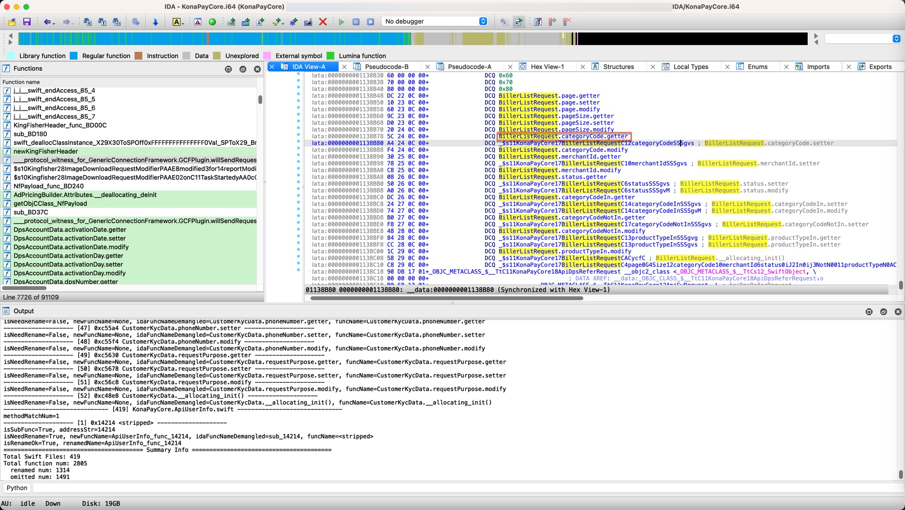

# updateSwiftMethods.py

* Update: `20250110`

## Function

IDA Plugin, from pasring input dsdump dumped Swift files, then update/rename Swift methods function into IDA

## Usage

use [crifan/dsdump](https://github.com/crifan/dsdump) to dump, got ouput contain: `output/{YourMachOFile}_header_dsdump/swift/class/`, use it as input swift files folder

then change `updateSwiftMethods.py`'s `inputSwiftClassFolder`

```py
inputSwiftClassFolder = "/xxx/output/{YourMachOFile}_header_dsdump/swift/class/"
```

to your input folder, then goto `IDA`->`File`->`Script file...`-> Selec&Run `updateSwiftMethods.py`

then it will: 

* update/rename Swift function names
  * also ouput rename result to file: `{YourMachOFile_folder}/output/renameResult/{YourMachOFile}_renameResult_{YYMMDD_HHMMSS}.json`

## Effect

### sub_xxx

* function name
  * before
    * `sub_28700`
  * after
    * `UserInfoServiceImpl_func_28700`
      * 
* related
  * input
    * `swift/class/KonaPayCore.UserInfoServiceImpl.swift`
      ```swift
      class KonaPayCore.UserInfoServiceImpl : _SwiftObject @rpath/libswiftCore.dylib, UserInfoService {

        // Properties
        ...

        // Swift methods
        0x27fa4  func <stripped> // method 
        0x283c0  func <stripped> // method 
        0x28504  func <stripped> // method 
        0x28700  func <stripped> // method 
      }
      ```
  * output
    * result dict: `IDA/output/renameResult/KonaPayCore_renameResult_20250109_230528.json`
      ```json
      {
        "extracted": {
          "funcAddress": "0x28700",
          "funcName": "<stripped>",
          "funcType": "func",
          "funcComment": "// method"
        },
        "orig": {
          "idaFuncNameDemangled": "sub_28700"
        },
        "isNeedRename": true,
        "renamedResultDict": {
          "address": "0x28700",
          "name": {
            "old": "sub_28700",
            "new": "UserInfoServiceImpl_func_28700"
          }
        }
      }
      ```

### Wrong Lumina Function name

* function name
  * before
    * `AccountKeyChain.rootAskPkcs12.getter`
      * 
  * after
    * `BillerListRequest.categoryCode.getter`
      * 
* related
  * input
    * `swift/class/KonaPayCore.BillerListRequest.swift`
      ```swift
      class KonaPayCore.BillerListRequest : _SwiftObject @rpath/libswiftCore.dylib {

        // Properties
        ...

        // Swift methods
        0xc22dc  func BillerListRequest.page.getter // getter 
        0xc2310  func BillerListRequest.page.setter // setter 
        0xc2360  func BillerListRequest.page.modify // modifyCoroutine 
        0xc239c  func BillerListRequest.pageSize.getter // getter 
        0xc23d0  func BillerListRequest.pageSize.setter // setter 
        0xc2420  func BillerListRequest.pageSize.modify // modifyCoroutine 
        0xc245c  func BillerListRequest.categoryCode.getter // getter 
        0xc24a4  func BillerListRequest.categoryCode.setter // setter 
        0xc24f4  func BillerListRequest.categoryCode.modify // modifyCoroutine 
        0xc2530  func BillerListRequest.merchantId.getter // getter 
        0xc2578  func BillerListRequest.merchantId.setter // setter 
        0xc25c8  func BillerListRequest.merchantId.modify // modifyCoroutine 
        0xc2608  func BillerListRequest.status.getter // getter 
        0xc2650  func BillerListRequest.status.setter // setter 
        0xc26a0  func BillerListRequest.status.modify // modifyCoroutine 
        0xc26dc  func BillerListRequest.categoryCodeIn.getter // getter 
        0xc2724  func BillerListRequest.categoryCodeIn.setter // setter 
        0xc2774  func BillerListRequest.categoryCodeIn.modify // modifyCoroutine 
        0xc27b0  func BillerListRequest.categoryCodeNotIn.getter // getter 
        0xc27f8  func BillerListRequest.categoryCodeNotIn.setter // setter 
        0xc2848  func BillerListRequest.categoryCodeNotIn.modify // modifyCoroutine 
        0xc2884  func BillerListRequest.productTypeIn.getter // getter 
        0xc28cc  func BillerListRequest.productTypeIn.setter // setter 
        0xc291c  func BillerListRequest.productTypeIn.modify // modifyCoroutine 
        0xc2958  class func BillerListRequest.__allocating_init() // init 
        0xc29c8  class func BillerListRequest.__allocating_init(page:pageSize:categoryCode:merchantId:status:categoryCodeIn:categoryCodeNotIn:productTypeIn:) // init 
      }
      ```
  * output
    * result dict: `IDA/output/renameResult/KonaPayCore_renameResult_20250109_230528.json`
      ```json
        {
          "extracted": {
            "funcAddress": "0xc245c",
            "funcName": "BillerListRequest.categoryCode.getter",
            "funcType": "func",
            "funcComment": "// getter "
          },
          "orig": {
            "idaFuncNameDemangled": "AccountKeyChain.rootAskPkcs12.getter"
          },
          "isNeedRename": true,
          "renamedResultDict": {
            "address": "0xC245C",
            "name": {
              "old": "AccountKeyChain.rootAskPkcs12.getter",
              "new": "BillerListRequest.categoryCode.getter"
            }
          }
        },
      ```
